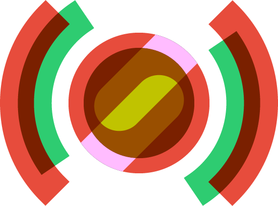

<p align="center">
  
</p>
<h3 align="center">
  Stream Overlay
</h3>
<p align="center">
  Dynamic stream overlay for broadcasters
</p>

This project was bootstrapped with [Create React App](https://github.com/facebook/create-react-app).

## Available Scripts

In the project directory, you can run:

```bash
$ npm start       # Runs the app in the development mode.
$ npm run build   # Build the app for production to the `build` folder.
```

## License

MIT
